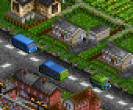
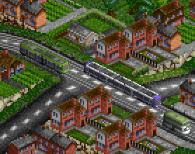

# Timberwolf's UK Road Vehicles

A road vehicle set for OpenTTD featuring buses, lorries, trams and others from early
horse-drawn wagons to the present day.

The set attempts to include a wide variety of vehicles from British haulage history.
It prioritises gameplay, and vehicle statistics are chosen in the interest of 
making road vehicles a viable alternative to rail transport - capacities are larger than
real world prototypes, and the top speed of early vehicles has been boosted. Parameters
are available for players who prefer more realistic capacities and speeds.

Both default industries and FIRS are explicitly supported - other industry sets such
as ECS may also be playable although vehicle graphics may not exactly match the carried
cargo.

The set has a regular version featuring graphics for 2x
zoom, and an HD version featuring 4x zoom at the cost of
a larger file size.

## Parameters

The following parameters are available:

### Gameplay and Visual Parameters

* **56mph speed limiters**: When this is enabled, any vehicle built after 1991 will have an
  appropriate speed limiter fitted - 56mph/90kph for lorries, and 62mph/100kph for large
  coaches and buses. This is based on the *build* date, not the vehicle introduction date.
* **Cars and vans obey national speed limit**: Some players may prefer that vans and cars do
  not attempt to reach their mechanical top speed and instead respect the UK speed limit of
  70mph. (This parameter may be less necessary when playing with a road set that enforces
  speed limits)
* **Realistic early vehicle statistics**: Reduce the capacity, speed and power of early
  vehicles (pre-1940) to realistic amounts. This can make the early game very hard with 
  vehicles that cannot cope with the amount of cargo generated, do not make enough profit 
  to cover the costs of their infrastructure and frequently stall out on hills.
* **Realistic modern vehicle capacity**: Reduce the capacity of modern vehicles (post-1940)
  to realistic amounts. (Speed and power amounts are generally realistic for these vehicles
  even in gameplay-balanced mode). This is a separate parameter as it does not significantly
  increase game difficulty, although road vehicles will be less useful than rail in almost
  all circumstances with this enabled.
* **Smoke effects**: By default vehicles produce exhaust smoke and various power effects.
  Some players may find this visually cluttering and prefer to switch the feature off.
* **Purchase Cost modifier**: The default purchase costs are chosen to provide a good
  balance with the original Transport Tycoon vehicles. For a harder or easier game these 
  can be increased or decreased, from 0.25x (a quarter of the default costs) to 32x.
  High amounts will make it very difficult to establish routes early in the game.
* **Running Cost modifier**: The default costs are chosen to provide a good balance with
  the original Transport Tycoon vehicles. For a harder or easier game these can be increased
  or decreased, from 0.25x (a quarter of the default costs) to 32x. The higher levels will
  make it almost impossible to make a profit, especially with early vehicles.

### Vehicle selection parameters

* **Enable Buses**: Enable large passenger vehicles such as the AEC Routemaster
* **Enable Lorries**: Enable large cargo vehicles such as the ERF C-Series
* **Enable Vans**: Enable smaller, faster cargo vehicles such as the Ford Transit
* **Enable Cars**: Enable cars and taxi cabs such as the Austin FX4
* **Enable Horse-Drawn Vehicles**: Enable vehicles which use horses for motive power 
  (combines with the other parameters - for stagecoaches both this and "enable buses" must
   be set)
* **Enable Steam Vehicles**: Enable vehicles which use steam for motive power
  (combines with the other parameters - for steam lorries both this and "enable lorries" must
   be set)
* **Enable Passenger Trams**: Enable passenger vehicles which run on tram rails
* **Enable Cargo Trams**: Enable cargo vehicles which run on tram rails
* **Enable Easter Eggs**: As an easter egg I included a couple of cars I've owned that would
  not typically be used for taxi or cargo services. Some players may prefer not to have these
  in the purchase list due to lack of realism.

### Tram purchase modes

* **Hybrid Tram Purchase Mode**: The set includes hybrid tram vehicles which are designed to
  run on both tram tracks and mainline rail. This parameter allows choosing whether these
  vehicles can be purchased as trams only, rail vehicles only, or both. (Or not available
  at all, if preferred)
* **Light Rail Purchase Mode**: The set includes light rail vehicles which are designed to
  run on dedicated light rail tracks, for which OpenTTD has no direct analog by default.
  This parameter allows choosing whether these vehicles can be purchased as trams only, 
  rail vehicles only, or both. (Or not available at all, if preferred)

## Vehicle Types

This set includes a wider range of vehicle types than vanilla Transport Tycoon, which
offered only large rigid lorries and intercity coaches. The various types and their
gameplay purpose is explained below.

### Buses

The following bus types are available:

#### Double Decker

These buses have high capacity but low top speed,
combined with good loading speeds. They are most
useful in city environments where distances are short
and passenger volumes are high.

#### Single Decker

These buses have a smaller capacity than double
deckers, but keep the same good loading speeds.
Although top speeds can still be relatively slow,
they are combined with low running costs which
makes these buses ideal for routes in smaller
towns which are short but don't have too many
passengers.

#### Coaches

Coaches are the closest to the buses featured in
the original Transport Tycoon, and several of
the same prototype vehicles are included.

They have more powerful engines and higher speeds,
but lower passenger capacity and slow loading speeds
compared to the urban bus types. Coaches are best
suited to an intercity network where large bus
stations on town outskirts can compensate for the
slower loading speeds.

#### Articulated Buses

Appearing later in the game, articulated buses are
an alternative to double deckers. They have high
passenger capacities and unmatched loading speed
due to the large number of doors. However they also
take up more space on the road and are more limited
in the types of bus station they can use, only
being able to call at drive-through road stops.

#### Midibuses

Sometimes a town doesn't generate enough passengers
to justify any of the full-sized bus types. To keep
station ratings high, it may be better to supply
a frequent service using 2-3 buses with around 20
passengers capacity than a single 60-passenger bus.

These smaller buses allow setting up these
low-demand services cost-effectively without 
having larger buses that run mostly empty to 
keep service frequent.

### Lorries

Unlike the original game, which offers a single
lorry for each type of cargo, most lorries in this 
set come default to carrying Goods but can be refit 
to any other in-game cargo. To change the cargo type 
of a lorry, use the **refit** button when it is
in a depot:

The following lorry types are available:

#### Articulated Lorries

Articulated lorries are the largest road cargo
vehicles seen in the UK, and carry large amounts
of cargo in separate trailers.

Early articulated lorries are very slow, but once
faster and more powerful versions arrive in the
1960s they are likely to be the mainstay of any
road cargo network, moving large amounts of cargo
with a relatively small number of vehicles.

Due to their heavy loads articulated lorries can
be very slow on steep inclines, and they are only
able to use drive-through road vehicle stops.

#### Rigid Lorries

Rigid lorries are the most similar to the lorries
featured in the original Transport Tycoon. They
are heavy vehicles built on an extended
chassis and can carry large amounts of heavy
cargo, although not as much as articulated lorries.

While their capacity may be lower, rigid lorries
often have superior power-to-weight and slightly
higher top speeds compared to their articulated
counterparts, and are useful when carrying heavy 
bulk cargo over hilly terrain, especially in the 
1970s and earlier before high powered European 
tractor units were introduced to the UK market. 
They are also more versatile in being able to use 
both types of road vehicle stop.

#### Small Lorries

Sometimes you don't want to transport as much
cargo as possible in a single vehicle, and
speed or the ability to deliver to many different
locations are more important.

Small lorries cover this need by offering limited
cargo capacity, but high speeds and low costs.
They are at their best used for cargo like FIRS
engineering and farm supplies where frequent small
deliveries are more important than the overall
volume of cargo. The higher speeds may also be
useful for time-critical deliveries such as Goods
in vanilla OpenTTD.

### Trams

The following tram types are available:

#### Passenger Trams

Trams need their own dedicated rails, but can move
many more passengers than a bus. Most models were
introduced from the 1890s to the 1930s, then
again starting in the late 1990s. Between these
years players will have to rely on the few tram 
models built for the Blackpool system which were
often cheaply adapted from buses or suffered
reliability problems.

Early trams are most useful for inner-city
networks and routes between nearby towns, 
but some later models introduced in the 1990s 
and 2000s are fast enough for longer services.

#### Cargo Trams

The cargo trams in this set most closely
represent the kind of industrial shortlines
that were common in the UK in the Victorian
era and as late as the 1960s in some cases.

Similar to this prototypical usage, cargo trams
are most useful when cargo needs to be moved
between two industry buildings over a short
distance. Although most cargo tram engines
have low top speeds, the ability to haul
multiple wagons gives them a high capacity
and a short distance industry chain can
be cost-effectively serviced with only
a small number of cargo trams.

#### Light Rail / Hybrid Rail

In addition to trams, this set includes vehicles
which would be more accurately considered light
rail, and hybrid trams which are deliberately
designed to operate both as trams and mainline
rail vehicles.

As this falls between two types of transport
offered by OpenTTD, players can select how
they want these vehicles to appear by a parameter -
as trams, as rail vehicles, both, or neither.

While offering high capacities and speeds compared
to smaller trams, these vehicles also take up a
lot of space. Using them is a fine balancing
act between moving large numbers of passengers on
key routes while not blocking other road vehicles
and creating excessive traffic.

### Small Vehicles

Small vehicles are included mostly for completeness
and the desire to represent more varieties of road
vehicle found in the UK.

However there are situations in which they can be
useful, either when OpenTTD generates tiny towns or
using industry sets and daylength patches that result
in low production values.

The following types of small vehicle are available:

#### Cars

This comprises both ordinary cars used as minicabs and
dedicated taxi cabs. (Cabs can be changed to a special
"black cab" livery using the refit menu)

Cars have a limited capacity but offer high top
speeds. In addition the greater comfort means passengers
are willing to tolerate longer journey times, and you
will find cargo payment rates do not decrease as quickly
with time as other vehicle types.

They are most useful for providing services to small villages
with only 1 or 2 houses, particularly when these are
are long distance away from other towns. This is particularly
the case when using a daylength patch or NewGRF which reduces
the number of passengers produced within a given time period.

#### Vans

Vans only carry small amounts of cargo, but they are
capable of high speeds compared to lorries. When delivering
time-sensitive cargo over long distances this can be
useful, especially when production volumes are low.

As in the real world, vans are also a good choice for
transporting smaller amounts of mail - if you have a town
where the passenger volumes only justify cars or the
smallest buses, vans are probably a good option for
providing the mail service.

#### Minibuses

Sometimes a car is too small, but only slightly. In this
case the set offers a few passenger conversions of vans.
They are faster than even small buses, but only have a
limited capacity. These may be a good option when towns
that have been serviced by cars start expanding and
overwhelming their passenger service.

## Building

If you are more interested in *building* the set, there
are a few important details to note.

### Workflow

Timberwolf's Road Vehicles has a workflow that at the
time of creation was unique amongst OpenTTD NewGRF sets,
although it owes a lot of its inception to Richard 
Wheeler's Pixeltool (http://www.richardwheeler.net/interactive/pixeltool.html).

Rather than using sprites, I use voxel objects created
in MagicaVoxel to create the set. This is why the only
PNG files you'll see in this repository are the ones
for the documentation.

Instead, a vehicle in this set starts its life as a
voxel object:

The steps it takes to become a sprite in an OpenTTD
NewGRF are as follows:

* Voxel objects for various cargo types are created
  using **Cargopositor**.
* The resultant voxel objects are rendered using
  **GoRender**.
* This produces PNG files which are combined with
  data and assembled into an NML file using
  **Roadie**.
* NML is used to compile the final `.grf` file.

A lot of the work in this set has gone into GoRender and
working out how to create graphics which look hand-drawn
enough to fit into the Transport Tycoon visual style and
scale acceptably to the low default sprite resolution for
players who don't use higher zoom levels.

### Tools

As the above suggests, this set uses a number of tools
I've built.

* Cargopositor (https://github.com/mattkimber/cargopositor) 
  composites vehicle objects and cargo objects into 
  voxel objects for each type of cargo.
* GoRender (https://github.com/mattkimber/gorender) is
  responsible for rendering voxel objects.
* Roadie (https://github.com/mattkimber/roadie) handles 
  the templates and creating NML files.

These are all written in Go, and building them is relatively
simple as they have no external dependencies - assuming you
have a functional Go environment, `go build` is sufficient
to build any of them.

If you have built `renderobject.exe` (from GoRender),
`cargopositor.exe` and `roadie.exe`, and have a working
installation of NML (https://github.com/OpenTTD/nml), it
will be sufficient to run `build.sh` in order to create 
the set. The somewhat strange mix of OS naming paradigms is 
because most of the computers I have available are using Git Bash on Windows. If you are not using these then `build.sh`
should be simple enough to reveal how each step works - the
only complexity is the check to not render a PNG file which
already exists, and this is only necessary if you are
worried about the amount of time NML will take to assemble
the compiled set if it does not have any image files
cached.
